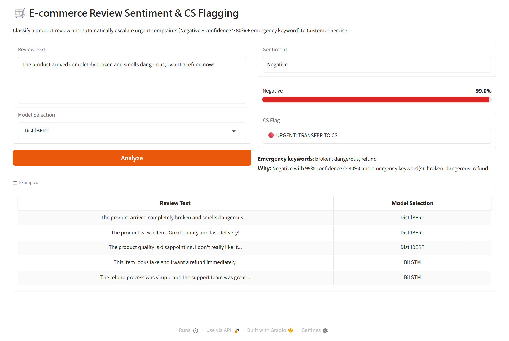
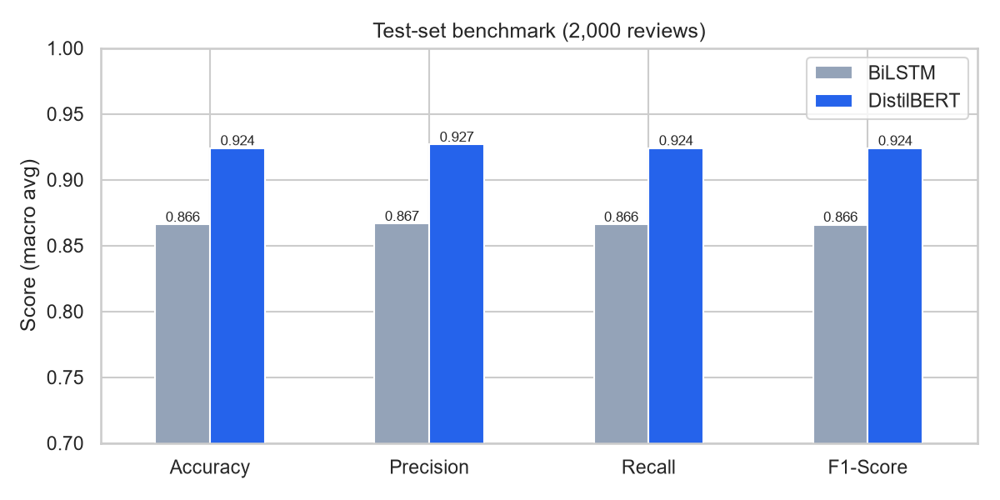
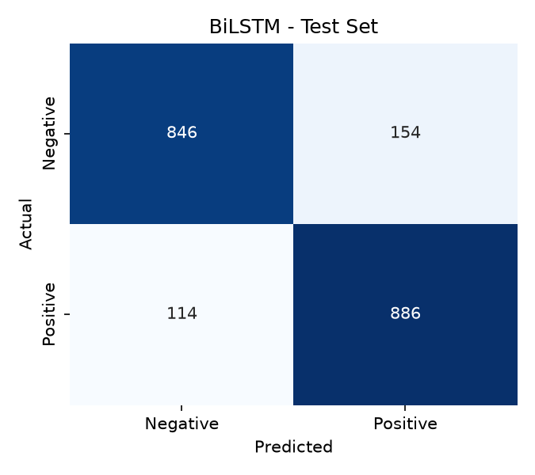
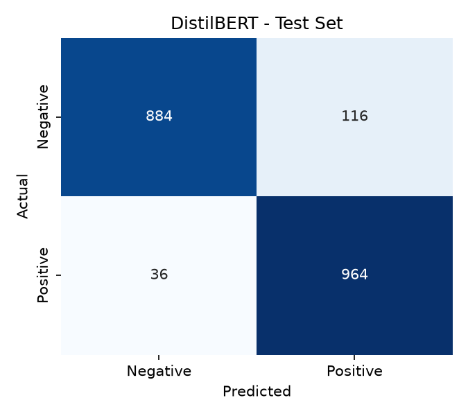

# 🛒 E-commerce Review Sentiment & CS Flagging System

An end-to-end NLP system that classifies product reviews as **Positive / Negative** and automatically
**flags urgent complaints** (fake products, broken items, refund demands, safety issues…) so they can be sent
straight to the Customer Service (CS) team.

It benchmarks a from-scratch **BiLSTM** baseline against a fine-tuned **DistilBERT** production model
(**92.4% test accuracy**) and serves both through a **Gradio** web app.



## Overview

**Problem.** Online shops receive far more reviews than a CS team can read. The few that need immediate
action (counterfeit goods, dangerous or broken products, refund requests) get buried among ordinary
feedback.

**Solution.**

1. A sentiment model predicts the review's polarity and a confidence score.
2. A separate, rule-based **CS flagging** layer escalates a review only when it is
   **Negative** *and* the model is **> 80% confident** *and* the text contains an **emergency keyword**.
3. A Gradio UI lets anyone paste a review, pick a model, and see the sentiment, confidence and CS flag.

```text
Amazon Reviews (Hugging Face)
        │
        ▼
Data preparation ── cleaning · balancing (10k/10k) · train/val/test split
        │
   ┌────┴─────┐
   ▼          ▼
 BiLSTM    DistilBERT
 baseline  production
   └────┬─────┘
        ▼
Inference: sentiment + confidence
        ▼
CS flagging: Negative AND confidence > 80% AND emergency keyword
        ▼
Gradio UI
```

## Features

- Sentiment classification (Positive / Negative) with a confidence score
- **BiLSTM baseline** built from scratch in PyTorch (custom vocabulary, padding, packed sequences)
- **DistilBERT production model** fine-tuned with the Hugging Face `Trainer`
- Benchmark of both models on the same held-out test set
- Emergency keyword detection (`fake, scam, broken, refund, worst, terrible, dangerous`)
- Automatic CS flagging: `🔴 URGENT: TRANSFER TO CS` / `✅ Normal`
- Gradio web UI with model selection
- Business logic, inference and UI in separate, unit-tested modules

## Tech Stack

Python 3.10+ · PyTorch · Hugging Face Transformers · Hugging Face Datasets · Pandas · Scikit-learn ·
Matplotlib / Seaborn · Gradio · pytest

## Project Structure

```text
ecommerce-sentiment-analyzer/
├── assets/demo.png             # App screenshot
├── data/                       # Local datasets (git-ignored, rebuilt by notebook 01)
├── models/
│   ├── bilstm_best.pt          # BiLSTM checkpoint (weights + vocab + hyperparameters)
│   └── distilbert/             # Fine-tuned DistilBERT config + tokenizer (weights: see Model weights)
├── notebooks/
│   ├── 01_eda_and_baseline_bilstm.ipynb   # Phases 1-2: EDA, data prep, BiLSTM training
│   └── 02_finetune_distilbert.ipynb       # Phases 3-5: DistilBERT, benchmark, CS-flag check
├── reports/                    # Metrics JSON, benchmark table and figures
├── src/
│   ├── config.py               # Paths, hyperparameters, business-rule constants
│   ├── data_utils.py           # Cleaning, balancing, splits, vocabulary, padding
│   ├── model_bilstm.py         # BiLSTM architecture, train/eval steps, checkpoint I/O
│   ├── flagging_logic.py       # CS flagging rules (independent of models and UI)
│   ├── inference.py            # Inference pipeline shared by the app and evaluation
│   └── evaluation.py           # Metrics, confusion matrices, benchmark
├── tests/                      # pytest unit tests
├── app.py                      # Gradio app
├── requirements.txt
└── PROJECT_REQUIREMENTS.md     # Original project specification
```

## Installation

```bash
git clone https://github.com/ndchien2004/ecommerce-sentiment-analyzer.git
cd ecommerce-sentiment-analyzer
python -m venv .venv
# Windows: .venv\Scripts\activate   |   macOS/Linux: source .venv/bin/activate

# Optional, for NVIDIA GPUs: install the CUDA build of PyTorch first
# pip install torch==2.11.0 --index-url https://download.pytorch.org/whl/cu128
pip install -r requirements.txt
```

### Model weights

- **BiLSTM:** `models/bilstm_best.pt` (13 MB) is included in the repository.
- **DistilBERT:** the weights (`model.safetensors`, ~255 MB) exceed GitHub's 100 MB file limit, so they are
  published as a release asset instead. **`python app.py` downloads them automatically on the first run**
  (`distilbert.zip`, ~236 MB) and extracts them into `models/distilbert/`. You have two alternatives:
  - Download [`distilbert.zip`](https://github.com/ndchien2004/ecommerce-sentiment-analyzer/releases/download/v1.0.0/distilbert.zip)
    from the [v1.0.0 release](https://github.com/ndchien2004/ecommerce-sentiment-analyzer/releases/tag/v1.0.0)
    and unzip it into `models/`.
  - Retrain it with `notebooks/02_finetune_distilbert.ipynb`, which takes about 5 minutes on an RTX 3050
    laptop GPU.

  If the download fails, the app still starts and the BiLSTM model keeps working.

## Run the Application

```bash
python app.py            # open http://127.0.0.1:7860
python app.py --share    # optional temporary public link
```

## Reproduce the Results

| Step | Command / notebook | Output |
|---|---|---|
| Data prep + EDA + BiLSTM | `notebooks/01_eda_and_baseline_bilstm.ipynb` | `data/processed/*.csv`, `models/bilstm_best.pt` |
| DistilBERT + benchmark | `notebooks/02_finetune_distilbert.ipynb` | `models/distilbert/`, `reports/` |
| Re-run the benchmark only | `python -m src.evaluation` | `reports/benchmark.md` |
| Unit tests | `pytest` | 26 tests |

Both notebooks run top to bottom, either locally or on Kaggle. When the repository is not found, the first
cell clones it.

## Benchmark

Both models were evaluated on the same **held-out test set of 2,000 reviews** (1,000 Positive / 1,000
Negative), which was never used for training or model selection. Precision, Recall and F1 are macro averages.

| Model | Accuracy | Precision | Recall | F1-Score |
|---|---:|---:|---:|---:|
| BiLSTM | 86.60% | 86.66% | 86.60% | 86.59% |
| DistilBERT | **92.40%** | **92.67%** | **92.40%** | **92.39%** |



| BiLSTM | DistilBERT |
|---|---|
|  |  |

**Takeaways**

- DistilBERT is **+5.8 points** more accurate than the BiLSTM baseline and meets the > 90% target.
- The BiLSTM overfits quickly: its validation loss is lowest at epoch 2, and early stopping keeps that
  checkpoint (see `reports/figures/bilstm_training_curves.png`).
- DistilBERT's errors lean toward calling negative reviews positive: 116 negatives were predicted positive,
  against 36 positives predicted negative. Negative recall is 88.4%. For CS triage, a missed negative
  review is the costlier mistake, so this is the first thing to improve, for example by weighting the
  negative class or lowering its decision threshold.

## Example

Outputs of the app for the test cases in the specification:

| Review | BiLSTM | DistilBERT | CS Flag |
|---|---|---|---|
| The product arrived completely broken and smells dangerous, I want a refund now! | Negative (86.5%) | Negative (99.0%) | 🔴 URGENT: TRANSFER TO CS |
| This item looks fake and I want a refund immediately. | Negative (99.4%) | Negative (99.3%) | 🔴 URGENT: TRANSFER TO CS |
| The product quality is disappointing. I don't really like it. | Negative (99.7%) | Negative (99.4%) | ✅ Normal (no keyword) |
| The refund process was simple and the support team was great. | Positive (97.1%) | Positive (97.1%) | ✅ Normal (not negative) |
| The product is excellent. Great quality and fast delivery! | Positive (99.8%) | Positive (99.4%) | ✅ Normal |

The flagging rule lives in `src/flagging_logic.py`. You can change keywords and the threshold without
touching the models:

```python
from src.flagging_logic import CSFlagger

flagger = CSFlagger(keywords=["never arrived", "rude", "fake"], threshold=0.9)
flagger.flag("Negative", 0.95, "The package never arrived.").label  # '🔴 URGENT: TRANSFER TO CS'
```

## Reproducibility

- Seed `42` everywhere (`src/config.py`); re-running notebook 01 reproduces identical BiLSTM metrics.
- Dataset: the first training shard of `fancyzhx/amazon_polarity` (900,000 reviews), using title + body. After
  cleaning and de-duplication it is balanced to 10,000 Positive + 10,000 Negative reviews.
- Split: stratified 80 / 10 / 10, giving 16,000 / 2,000 / 2,000 reviews. The test set is never used for
  training or tuning.
- Hyperparameters are in `src/config.py`. BiLSTM: batch 32, Adam lr 1e-3, early stopping with patience 3.
  DistilBERT: batch 16, lr 2e-5, 2 epochs, 10% warmup, fp16, max length 256.
- Library versions are pinned in `requirements.txt`. Tested with Python 3.11.
